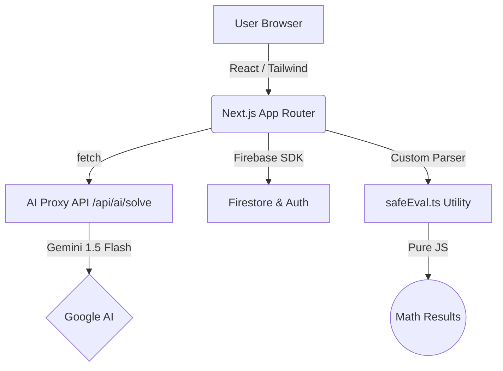
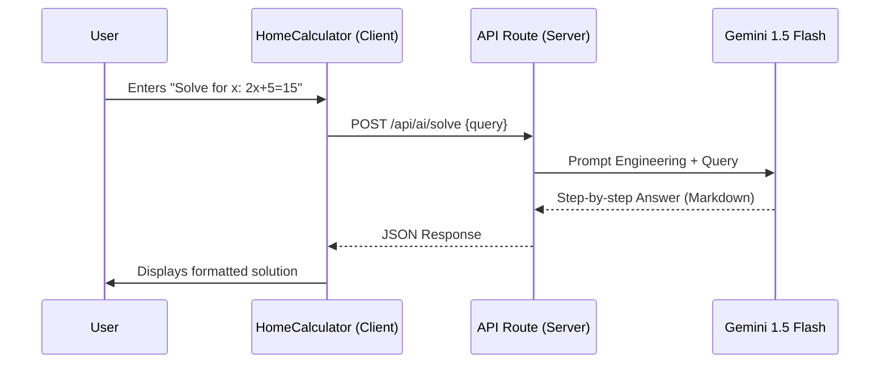

# CalcPro.NP — Developer Handover & Architecture Report

This document provides a technical overview of the **CalcPro.NP** platform for future developers. It details the architecture, safety protocols, and core workflows.

---

## 🏗 System Architecture

CalcPro.NP is built using **Next.js 14 (App Router)** for high-performance server-side rendering and SEO, coupled with **Firebase** for dynamic content (blog, SEO guides) and administrative control.

---

## 🧮 Core Math Engine: `safeEval.ts`

To ensure 100% security and zero production vulnerabilities, we explicitly **forbid `eval()` or `Function()`**. All arithmetic is handled by a custom recursive descent parser.

### Key Logic:
1.  **Lexer**: Tokenizes strings (numbers, constants like `pi`, operators, and functions).
2.  **Parser**: Implements Order of Operations (PEMDAS) via recursive function calls:
    - `parseExpression` (Addition/Subtraction)
    - `parseTerm` (Multiplication/Division)
    - `parseFactor` (Power/Exponents)
3.  **Validation**: Strict check for divide-by-zero or imaginary results.

---

## ✨ AI Math Solver Workflow

The AI Solver leapfrogs traditional calculators by providing step-by-step logic.

### Process Flow:

---

## 📱 Mobile-First Design Principles

The UI is optimized for real-world usage in Nepal, where 80%+ traffic is mobile.
- **Touch Targets**: All interactive elements are minimum `44px` height (Apple/Google standard).
- **Mode Grid**: A 2x2 selection grid on the homepage prevents deep-menu navigation.
- **Dark Mode**: High-contrast theme reduces battery drain on OLED mobile screens.
- **Keyboard Support**: Full physical keyboard support (0-9, operators, Enter, Backspace) for power users on Desktop.

---

## 🛠 Admin & SEO Strategy

The platform includes a custom **SEO Page Editor** to allow non-technical admins to create high-ranking guides.

### Workflow:
1.  **Drafting**: Admin enters content in Markdown.
2.  **Live Score**: The `SEOScorePanel` provides real-time feedback (Word count, keyword density, etc.).
3.  **Internal Linking**: A managed selector adds related calculators at the bottom of guides to reduce bounce rate.
4.  **Security**: Protected by both Firebase Auth and a middleware-level `ADMIN_SECRET_TOKEN`.

---

## 🚀 Deployment Instructions for New Developers

1.  **Environment**: Create `.env.local` using `.env.example`.
2.  **Build**: Run `npm run build` to verify production types.
3.  **Sitemap**: Visit `/sitemap.xml` after deployment to confirm indexing.
4.  **Rules**: Deploy `firestore.rules` using the Firebase CLI to harden the database.

> [!IMPORTANT]
> Always verify that the `ADMIN_SECRET_TOKEN` in Vercel matches the one set in the `AdminLoginPage` session cookie logic.
